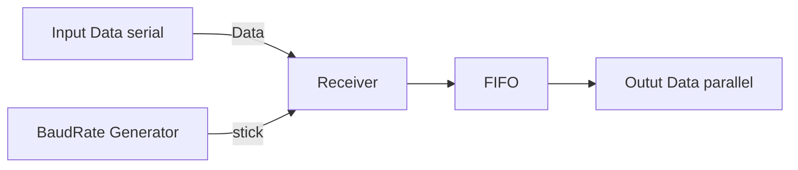
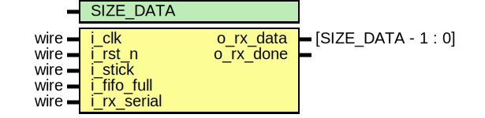

# Overview UART

## Diagram structure of UART using verilog code

## Baud Rate Generator 

| Signal | Size | Func |
| ------ | ---- | ---- | 
| i_clk | 1 | Xung clock của hệ thống CPU |
| i_rst_n | 1 | Tín hiệu reset tích cực thấp |
| i_bdr_value | SIZE_BAUD | Giá trị baudrate yêu cầu |
| o_stick | 1 | Tín hiệu đồng bộ giữa bên phát và bên thu |

Giá trị i_bdr_value thể hiện bằng công thức là:

$ \text{i\_bdr\_value} = \frac{FREQ}{BAUD \times OVERSAMPLING} $

## Receiver Block

| Signal | Size | Func |
| ------ | ---- | ---- |
| i_clk | 1 | Xung clock của hệ thống CPU |
| i_rst_n | 1 | Tín hiệu reset tích cực thấp |
| i_stick | 1 | tín hiệu lấy mẫu |
| i_rd_uart | 1 | Cho phép đọc dữ liệu từ FIFO |
| i_rx_data | 1 | Dữ liệu serial vào bộ thu, dữ liệu nhận được |
| o_dout | SIZE_DATA | Data sau khi loại bỏ các bit như Start, Stop, Party |
| o_rx_empty | 1 | Bộ FIFO empty |
| o_rx_full | 1 | Bộ FIFO full |

### Receiver

| Signal | Size | Func |
| ------ | ---- | ---- |
| i_clk | 1 | Xung clock của hệ thống CPU |
| i_rst_n | 1 | Tín hiệu reset tích cực thấp |
| i_stick | 1 | tín hiệu lấy mẫu |
| i_rx_data | 1 | Dữ liệu serial vào bộ thu, dữ liệu nhận được |
| i_fifo_full | 1 | Tín hiệu cho biết FIFO có tiếp tục ghi được không |
| o_dout | SIZE_DATA | Data sau khi loại bỏ các bit như Start, Stop, Party|
| o_rx_done | 1 | Tín hiệu dữ liệu vào FIFO|

### FIFO

| Signal | Size | Func |
| ------ | ---- | ---- |
| i_clk | 1 | Xung clock của hệ thống CPU |
| i_rst_n | 1 | Tín hiệu reset tích cực thấp |
| i_fifo_data | SIZE_DATA | Dữ liệu vào FIFO |
| i_wr_en | 1 | Tín hiệu cho phép ghi |
| i_rd_en | 1 | Tín hiệu cho phép đọc |
| o_fifo_data | SIZE_DATA | Dữ liệu ra FIFO |
| o_full | 1 | Tín hiệu báo FIFO đầy |
| o_empty | 1 | Tín hiệu báo FIFO trống |

## Transmitter Block

| Signal | Size | Func |
| ------ | ---- | ---- | 
| i_clk | 1 | Xung clock của hệ thống CPU |
| i_rst_n | 1 | Tín hiệu reset tích cực thấp |
| i_stick | 1 | tín hiệu lấy mẫu |
| i_tx_go | 1 | Tín hiệu cho biết dữ liệu data hợp lệ vào |
| i_tx_data | 8bit/9bit | Dữ liệu parallel đầu vào, là dữ liệu cần truyền đi |
| o_dout | 1 | Dữ liệu serial đầu ra |
| o_tx_done | 1 | Tín hiệu bộ phát đã phát đủ dữ liệu |
